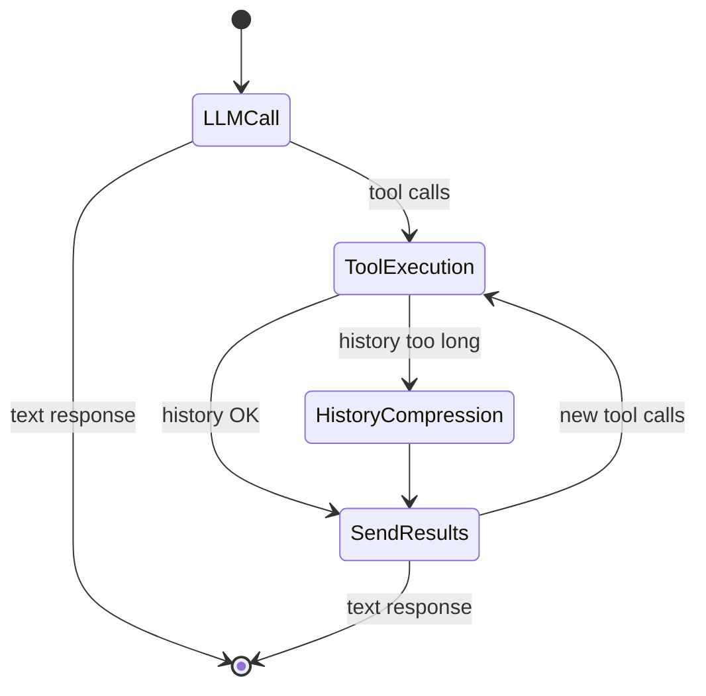

## Introduction

Building an LLM agent "by hand" is fun for about two hours. But the real questions show up fast: how do you handle a conversation that outgrows the context window? How do you structure a workflow with more than three steps? How do you plug in your own tools without rewriting a homemade function-calling parser?

[Koog](https://docs.koog.ai/) is JetBrains' agentic framework. It's written in Kotlin and targets the JVM first, with integrations for Spring Boot, Spring AI and Ktor. Version 1.0 shipped in May 2026, announced at the [KotlinConf keynote](https://blog.jetbrains.com/ai/2026/05/koog-1-0-is-out-stable-core-better-interop-and-multiplatform-observability/).

Let's find out together whether this brand-new JVM framework lives up to its promises!

> All the examples below are in Kotlin.
> {.tip}

## A surprisingly gentle learning curve

Koog's entry point is a Kotlin DSL (with a Java API added since March 2026). No sprawling YAML: you declare your agent, its tools and its strategy directly in typed code. A "hello world" agent fits in a few lines:

```kotlin
fun main() = runBlocking {
    val apiKey = System.getenv("ANTHROPIC_API_KEY")
        ?: error("The API key is not set.")

    val agent = AIAgent(
        promptExecutor = MultiLLMPromptExecutor(AnthropicLLMClient(apiKey)),
        llmModel = AnthropicModels.Opus_4_1
    )

    val result = agent.run("Hello! How can you help me?")
    println(result)
}
```

Declaring a custom tool is just as direct: a class implementing `ToolSet`, a method annotated `@Tool`, some `@LLMDescription` to guide the model, and the tool is ready to use as soon as it's registered in the agent's `ToolRegistry`:

```kotlin
@LLMDescription("Tools for getting weather information")
class MyFirstToolSet : ToolSet {
    @Tool
    @LLMDescription("Get the current weather for a location")
    fun getWeather(
        @LLMDescription("The city and state/country")
        location: String
    ): String {
        return "The weather in $location is sunny and 72°F"
    }
}

fun main() = runBlocking {
    val agent = AIAgent(
        promptExecutor = simpleOpenAIExecutor(apiToken),
        systemPrompt = "Provide weather information for a given location.",
        llmModel = OpenAIModels.Chat.GPT4o,
        toolRegistry = ToolRegistry {
            tools(MyFirstToolSet())
        }
    )

    agent.run("What's the weather like in New York?")
}
```

## Custom state graphs

Koog doesn't settle for a "prompt → tool → prompt" loop. It exposes a genuine **strategy graph** architecture (`AIAgentGraphStrategyBuilder`), built from three pieces:

- **nodes**, which encapsulate a processing step (LLM call, tool call, history compression, data transformation...);
- **edges**, which connect nodes and can carry conditions: an edge is only followed if its condition holds;
- **subgraphs**, self-contained processing units with their own context and their own tools.

Every node has an input type and an output type, and so does the strategy itself, which means branching errors show up at compile time rather than in production.

Koog ships two ready-made strategies: `chatAgentStrategy`, for conversational interaction, and `reActStrategy`, which implements the ReAct pattern by alternating reasoning and action phases at a frequency tunable via the `reasoningInterval` parameter. But those are just starting points. As soon as the use case goes off the beaten path (validation loops, branching on a tool's result, specialized sub-agents relaying each other on a complex task), you drop down to the graph and assemble your own nodes. Here, for instance, is a simple hand-written tool-calling loop that runs until it gets a text response:

```kotlin
val calculatorAgentStrategy = strategy<String, String>("Simple calculator") {
    val sendInput by nodeLLMRequest()
    val executeTools by nodeExecuteTools()
    val sendToolResults by nodeLLMSendToolResults()

    edge(nodeStart forwardTo sendInput)
    edge(sendInput forwardTo nodeFinish onTextMessage { true })
    edge(sendInput forwardTo executeTools onToolCalls { true })
    edge(executeTools forwardTo sendToolResults)
    edge(sendToolResults forwardTo nodeFinish onTextMessage { true })
    edge(sendToolResults forwardTo executeTools onToolCalls { true })
}
```

The only constraint: every `strategy { }` needs a complete path between `nodeStart` and `nodeFinish`. Everything else, intermediate nodes, loops, branches, is up to you.

## The agentic loop, and automatic history compression

The heart of the matter is still the agentic loop: the agent calls the LLM, possibly receives tool-call requests, executes them, feeds the results back, and repeats until it gets a final answer. Koog handles this loop natively, with configurable retries and checkpoint-based persistence (which restores the agent's full state machine, not just the message history).

That leaves the long-context problem. An agentic conversation spanning dozens of iterations, tool calls included, makes the number of tokens sent on every request explode. Koog offers **automatic history compression**, pluggable as a full-fledged node in the graph (`nodeLLMCompressHistory` in Kotlin, `AIAgentNode.llmCompressHistory()` on the Java side), with several ready-made strategies:

- `HistoryCompressionStrategy.WholeHistory` (the default): summarizes the entire conversation into a single synthesis message.
- `HistoryCompressionStrategy.FromLastNMessages(n)`: only compresses the last *n* messages.
- `HistoryCompressionStrategy.Chunked(size)`: splits the history into fixed-size segments and summarizes each one independently, keeping both the distant past and the recent present.
- `FactRetrievalHistoryCompressionStrategy`: extracts only the facts relevant to a list of concepts you provide, rather than a generic summary.

If none of these fit your use case, nothing stops you from extending `HistoryCompressionStrategy` to write your own. Enough to run agents for a long time without the token bill (or the latency) becoming unmanageable.

Here's what it looks like once wired into a strategy graph, with compression triggered conditionally after a tool call:

```kotlin
// Homemade helper, not a framework API: it's on you to define the threshold
private suspend fun AIAgentContext.historyIsTooLong(): Boolean =
    llm.readSession { prompt.messages.size > 100 }

val strategy = strategy<String, String>("execute-with-history-compression") {
    val callLLM by nodeLLMRequest()
    val executeTool by nodeExecuteTools()
    val sendToolResult by nodeLLMSendToolResults()

    val compressHistory by nodeLLMCompressHistory<ReceivedToolResults>()

    edge(nodeStart forwardTo callLLM)
    edge(callLLM forwardTo nodeFinish onTextMessage { true })
    edge(callLLM forwardTo executeTool onToolCalls { true })

    edge(executeTool forwardTo compressHistory onCondition { historyIsTooLong() })
    edge(compressHistory forwardTo sendToolResult)
    edge(executeTool forwardTo sendToolResult onCondition { !historyIsTooLong() })

    edge(sendToolResult forwardTo executeTool onToolCalls { true })
    edge(sendToolResult forwardTo nodeFinish onTextMessage { true })
}
```

Which, visually, gives:



## GOAP: algorithmic planning

Koog can also do **GOAP** (*Goal-Oriented Action Planning*), a technique popularized by video games (perhaps the best-known example being the soldiers' AI in [F.E.A.R.](https://www.gamedeveloper.com/design/building-the-ai-of-f-e-a-r-with-goal-oriented-action-planning), 2005) that turns out to be effective for organizing an agent's behavior.

Unlike an "LLM-based" planner, which asks the model to generate the action sequence itself, a GOAP agent **discovers it algorithmically**. In practice, you declare:

- a **state**, as a data class, representing the relevant properties of the agent's world;
- **actions**, each with a precondition (what must be true to run it), a cost, and a *belief*: the optimistic prediction of the resulting state, used only during planning;
- **goals**, with their completion condition.

The planner starts from the goal, not from the current state: the [A* search](https://en.wikipedia.org/wiki/A*_search_algorithm) walks the chain of preconditions backward, from the action that satisfies the goal down to one that can run right away, minimizing the total cost of the resulting path. That backward search is what makes the algorithm efficient: exploring from the goal keeps the state space you have to consider small, instead of fanning out in every direction from the current state. The distinction between the *belief* and the actual result matters: the plan is built on these predictions, but it's the actual execution of each action that updates the current state, the one the planner starts back from at the next step. If an action fails or produces an unexpected result, the agent notices and replans. That's what makes the approach interesting when several paths lead to the goal, or when conditions change along the way.

Here's an example for a content-writing agent, which has to go through a plan (write, review, publish) without the order being hardcoded. To give the planner an actual choice to make (rather than a linear chain in disguise), it gets two ways to obtain a plan: generate it through the LLM, or reuse one already provided by the caller:

```kotlin
data class ContentState(
    val topic: String,
    val providedOutline: String? = null,
    val hasOutline: Boolean = false,
    val outline: String = "",
    val hasDraft: Boolean = false,
    val draft: String = "",
    val hasReview: Boolean = false,
    val isPublished: Boolean = false
) : GoapAgentState<String, String>() {
    override val agentInput = topic
    override fun provideOutput(): String = draft
}

val planner = goap("content-planner", ::ContentState) {
    action(name = "Use provided outline",
        precondition = { state -> !state.hasOutline && state.providedOutline != null },
        belief = { state -> state.copy(hasOutline = true, outline = state.providedOutline!!) },
        cost = { 0.1 }
    ) { ctx, state -> state.copy(hasOutline = true, outline = state.providedOutline!!) }

    action(name = "Create outline",
        precondition = { state -> !state.hasOutline },
        belief = { state -> state.copy(hasOutline = true, outline = "Outline") },
        cost = { 1.0 }
    ) { ctx, state -> /* LLM call to generate the outline */ }

    action(name = "Write draft",
        precondition = { state -> state.hasOutline && !state.hasDraft },
        belief = { state -> state.copy(hasDraft = true, draft = "Draft") },
        cost = { 2.0 }
    ) { ctx, state -> /* LLM call to write the draft */ }

    action(name = "Review content",
        precondition = { state -> state.hasDraft && !state.hasReview },
        belief = { state -> state.copy(hasReview = true) },
        cost = { 1.0 }
    ) { ctx, state -> /* LLM call to review */ }

    action(name = "Publish",
        precondition = { state -> state.hasReview && !state.isPublished },
        belief = { state -> state.copy(isPublished = true) },
        cost = { 1.0 }
    ) { ctx, state -> state.copy(isPublished = true) }

    goal(name = "Published article",
        description = "Complete and publish the article",
        condition = { state -> state.isPublished }
    )
}

// The planner isn't an agent: wrap it in a strategy
val agent = AIAgent(
    promptExecutor = executor,
    strategy = AIAgentPlannerStrategy.create("content-agent", planner),
    llmModel = OpenAIModels.Chat.GPT4o
)
```

None of these actions explicitly say "do A then B then C": it's the planner that, starting from the preconditions and the final goal (`isPublished == true`), reconstructs the execution order itself. And depending on whether `providedOutline` is set, it picks "Use provided outline" (cost 0.1, no LLM call) over "Create outline" (cost 1.0): two different paths to the same goal, without a single hand-written branch.

One question comes up fast: what happens if the planner never converges, for instance because two actions keep undoing each other in a loop (one resetting the state to the configuration the other just tore down)? On Koog's side, the only documented safety net is generic to every agent: the `maxAgentIterations` parameter on `AIAgentConfig`, which caps the total number of iterations, planning included. Nothing as targeted as an actual *stuck handler* dedicated to the planner yet.

> Compare that with how [Embabel](https://hub.embabel.com/) does it: it exposes a `StuckHandler` interface to explicitly handle the "stuck" state, plus a `Budget` (number of actions, cost, tokens) wired into its `EarlyTerminationPolicy` to cut loops short. Worth watching if you plan to lean on GOAP in production.
> {.info}

Two practical details: planners live in a separate module (`agents:agents-planners`, to add explicitly to your dependencies), and this part of Koog is still stamped beta. The API can move.

## Tools, MCP and A2A: an agent never works alone

An agent, however well designed, is only as good as the tools it can act on. Koog natively ships a **tools** system with a typed registry (name, description, input schema) and the ability to declare your own business tools in a few lines.

Support for the [Model Context Protocol (MCP)](https://modelcontextprotocol.io/docs/2026-07-28/getting-started/intro) is included out of the box, via `McpToolRegistryProvider`: Koog connects to an MCP server over stdio (`defaultStdioTransport`) or SSE (`defaultSseTransport`), dynamically discovers the available tools, turns them into Koog tools and registers them in the agent's tool registry. Whether that server exposes Google Maps, Playwright or your own internal tooling, the calling code doesn't change.

For multi-agent architectures, Koog implements the [A2A (Agent-to-Agent)](https://a2a-protocol.org/latest/) protocol in version 0.3.0, both client and server side. You can expose a Koog agent as an A2A server consumable by any compatible agent, or have a Koog agent talk to third-party agents that respect the protocol.

## Integrations: Spring Boot, Spring AI, Ktor

Koog is designed to fit into your JVM ecosystem with as little friction as possible:

- **Spring Boot** has its own dedicated starter, `koog-spring-boot-starter`. It auto-configures `PromptExecutor` beans from your properties (`openAIExecutor`, `anthropicExecutor`, `googleExecutor`, `ollamaExecutor`, `multiLLMPromptExecutor`...).
- **Spring AI** gets a broader integration, with four independent starters: `koog-spring-ai-starter-model-chat` (adapts a Spring AI `ChatModel` into a Koog `LLMClient`), `-model-embedding` (an `EmbeddingModel` into an `LLMEmbeddingProvider`), `-chat-memory` (a `ChatMemoryRepository` into a `ChatHistoryProvider`) and `-vector-store` (a `VectorStore` into a `KoogVectorStore`). The split of responsibilities is clear: Spring AI covers model access, chat memory and vector storage for RAG, Koog adds orchestration, multi-step strategies and resilience on top. One thing worth knowing: even when the model goes through Spring AI, it's Koog that executes the tools. Spring AI only receives the definitions and schemas, with `internalToolExecutionEnabled` forced to `false`.
- **Ktor** also has a dedicated plugin, for backends that prefer to stay on the native Kotlin ecosystem rather than Spring.
- On the LLM provider side, the list is wide: OpenAI, Anthropic, Google, DeepSeek, Mistral, Alibaba, AWS Bedrock, Ollama for local models. And you can switch a conversation to a different model mid-way, with a different set of tools, without losing the history.

Observability isn't left out either, since Koog relies on OpenTelemetry, with ready-made integrations for Langfuse, W&B Weave and Datadog.

## NB: Kotlin first, Java more recently, and a stable/beta line worth watching

Two things to watch out for before diving in head first:

- Koog remains a **Kotlin-first** framework. Java support arrived in March 2026, with a fluent builder API and access to the core features. That said, new features keep landing on the Kotlin side first. If you're in pure Java, check the documentation case by case to confirm the feature you're after is actually ported.
- Since 1.0, Koog explicitly splits its modules into two tracks: **stable**, where APIs don't break without a deprecation cycle, and **beta**, where they can change. That's rather good news, but it also means part of what makes Koog interesting, GOAP first among them, sits on the beta side. Worth weighing before betting everything on it in production.

## Conclusion

Koog ticks a rare box: an agentic framework designed for the JVM, that sacrifices neither ergonomics (Kotlin DSL, Java builders) nor power (custom state graphs, GOAP, MCP, A2A), while integrating cleanly into existing Spring Boot and Spring AI stacks. If you need LLM agents to coexist with an existing Java or Kotlin backend rather than standing up a parallel Python stack, it's clearly worth a look.

Its direct competitor on the JVM is [Embabel](https://hub.embabel.com/), which I'd also recommend keeping an eye on!

The official documentation is available at [docs.koog.ai](https://docs.koog.ai/).
