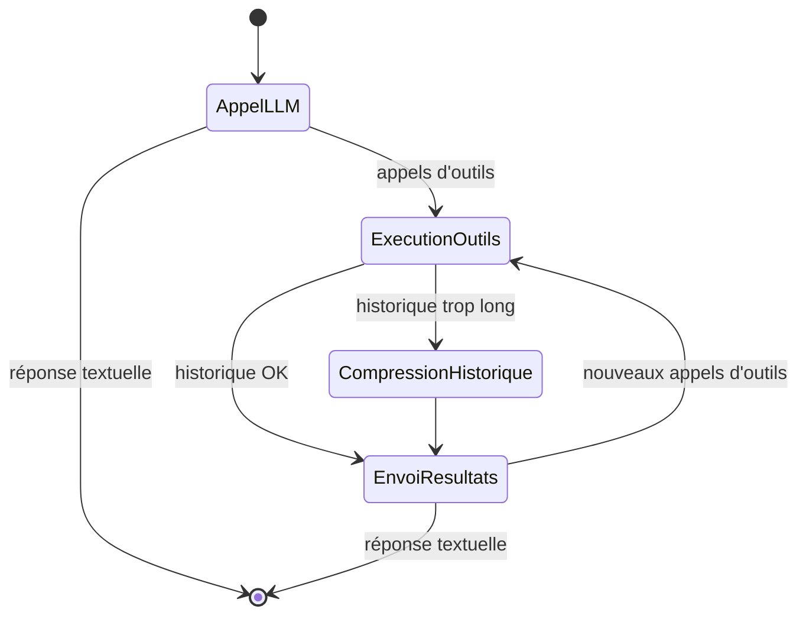

## Introduction

Construire un agent LLM "à la main", c'est amusant pendant deux heures. Mais, rapidement, émergent les vraies questions : comment gérer une conversation qui dépasse la fenêtre de contexte ? Comment structurer un workflow qui a plus de trois étapes ? Comment brancher ses propres outils sans réécrire un parseur de function-calling maison ?

[Koog](https://docs.koog.ai/) est le framework agentique de JetBrains. Il est écrit en Kotlin et cible principalement la JVM, avec ses intégrations Spring Boot, Spring AI et Ktor. La version 1.0 est sortie en mai 2026, annoncée à [la keynote de KotlinConf](https://blog.jetbrains.com/ai/2026/05/koog-1-0-is-out-stable-core-better-interop-and-multiplatform-observability/).

Découvrons ensemble si ce framework JVM tout neuf tient ses promesses !

> Tous les exemples sont donnés en Kotlin.
> {.tip}

## Une prise en main étonnamment simple

Le point d'entrée de Koog est un DSL Kotlin (avec, depuis mars 2026, une API Java). Pas de YAML tentaculaire : on déclare son agent, ses outils et sa stratégie directement en code typé. Le "hello world" d'un agent tient en quelques lignes :

```kotlin
fun main() = runBlocking {
    val apiKey = System.getenv("ANTHROPIC_API_KEY")
        ?: error("The API key is not set.")

    val agent = AIAgent(
        promptExecutor = MultiLLMPromptExecutor(AnthropicLLMClient(apiKey)),
        llmModel = AnthropicModels.Opus_4_1
    )

    val result = agent.run("Hello! How can you help me?")
    println(result)
}
```

Déclarer un outil personnalisé est tout aussi direct : une classe qui implémente `ToolSet`, une méthode annotée `@Tool`, des `@LLMDescription` pour guider le modèle, et l'outil devient utilisable dès qu'on l'enregistre dans le `ToolRegistry` de l'agent :

```kotlin
@LLMDescription("Tools for getting weather information")
class MyFirstToolSet : ToolSet {
    @Tool
    @LLMDescription("Get the current weather for a location")
    fun getWeather(
        @LLMDescription("The city and state/country")
        location: String
    ): String {
        return "The weather in $location is sunny and 72°F"
    }
}

fun main() = runBlocking {
    val agent = AIAgent(
        promptExecutor = simpleOpenAIExecutor(apiToken),
        systemPrompt = "Provide weather information for a given location.",
        llmModel = OpenAIModels.Chat.GPT4o,
        toolRegistry = ToolRegistry {
            tools(MyFirstToolSet())
        }
    )

    agent.run("What's the weather like in New York?")
}
```

## Des graphes d'états sur-mesure

Koog ne se contente pas d'une boucle "prompt → outil → prompt". Il expose une véritable architecture en **graphe de stratégie** (`AIAgentGraphStrategyBuilder`), composée de trois briques :

- des **nœuds**, qui encapsulent une étape de traitement (appel LLM, appel d'outil, compression d'historique, transformation de données...) ;
- des **arêtes**, qui relient les nœuds et peuvent porter des conditions : on ne suit une arête que si telle condition est vraie ;
- des **sous-graphes**, des unités de traitement autonomes avec leur propre contexte et leurs propres outils.

Chaque nœud a un type d'entrée et un type de sortie, et la stratégie elle-même en a un aussi, ce qui fait que les erreurs de branchement se voient à la compilation plutôt qu'en production.

Koog livre deux stratégies prêtes à l'emploi : `chatAgentStrategy`, pour une interaction conversationnelle, et `reActStrategy`, qui implémente le pattern ReAct en alternant phases de raisonnement et phases d'action, à une fréquence réglable via le paramètre `reasoningInterval`. Mais ce ne sont que des points de départ. Dès que le cas d'usage sort du cadre (boucles de validation, branchements selon le résultat d'un outil, sous-agents spécialisés qui se relaient sur une tâche complexe), on redescend sur le graphe et on assemble ses propres nœuds. Voici par exemple une simple boucle d'appels d'outils, écrite à la main, qui tourne jusqu'à obtenir une réponse textuelle :

```kotlin
val calculatorAgentStrategy = strategy<String, String>("Simple calculator") {
    val sendInput by nodeLLMRequest()
    val executeTools by nodeExecuteTools()
    val sendToolResults by nodeLLMSendToolResults()

    edge(nodeStart forwardTo sendInput)
    edge(sendInput forwardTo nodeFinish onTextMessage { true })
    edge(sendInput forwardTo executeTools onToolCalls { true })
    edge(executeTools forwardTo sendToolResults)
    edge(sendToolResults forwardTo nodeFinish onTextMessage { true })
    edge(sendToolResults forwardTo executeTools onToolCalls { true })
}
```

La seule contrainte : chaque `strategy { }` doit avoir un chemin complet entre `nodeStart` et `nodeFinish`. Tout le reste, nœuds intermédiaires, boucles, branches, est à la carte.

## La boucle agentique, et la compression automatique de l'historique

Le cœur du sujet reste donc la boucle agentique : l'agent appelle le LLM, reçoit éventuellement des demandes d'appel d'outils, les exécute, réinjecte les résultats, et recommence jusqu'à obtenir une réponse finale. Koog gère cette boucle nativement, avec un mécanisme de retry configurable et de la persistance par checkpoints (qui restaure la machine à états complète de l'agent, pas seulement l'historique de messages).

Reste le problème du contexte long. Une conversation agentique qui s'étale sur des dizaines d'itérations, appels d'outils compris, fait exploser le nombre de tokens envoyés à chaque requête. Koog propose une **compression automatique de l'historique**, activable comme un nœud à part entière dans le graphe (`nodeLLMCompressHistory` en Kotlin, `AIAgentNode.llmCompressHistory()` côté Java), avec plusieurs stratégies prêtes à l'emploi :

- `HistoryCompressionStrategy.WholeHistory` (par défaut) : résume l'intégralité de la conversation en un seul message de synthèse.
- `HistoryCompressionStrategy.FromLastNMessages(n)` : ne compresse que les *n* derniers messages.
- `HistoryCompressionStrategy.Chunked(size)` : découpe l'historique en segments de taille fixe et résume chaque segment indépendamment, pour garder à la fois le passé lointain et le présent récent.
- `FactRetrievalHistoryCompressionStrategy` : extrait uniquement les faits pertinents par rapport à une liste de concepts que vous fournissez, plutôt qu'un résumé généraliste.

Si aucune ne correspond à votre cas d'usage, rien n'empêche d'étendre `HistoryCompressionStrategy` pour écrire la vôtre. De quoi faire tourner des agents longtemps sans que la facture de tokens (ni la latence) ne devienne ingérable.

Voici à quoi ça ressemble une fois branché sur un graphe de stratégie, avec une compression déclenchée conditionnellement après l'exécution d'un outil :

```kotlin
// Helper maison, pas une API du framework : à vous de définir le seuil
private suspend fun AIAgentContext.historyIsTooLong(): Boolean =
    llm.readSession { prompt.messages.size > 100 }

val strategy = strategy<String, String>("execute-with-history-compression") {
    val callLLM by nodeLLMRequest()
    val executeTool by nodeExecuteTools()
    val sendToolResult by nodeLLMSendToolResults()

    val compressHistory by nodeLLMCompressHistory<ReceivedToolResults>()

    edge(nodeStart forwardTo callLLM)
    edge(callLLM forwardTo nodeFinish onTextMessage { true })
    edge(callLLM forwardTo executeTool onToolCalls { true })

    edge(executeTool forwardTo compressHistory onCondition { historyIsTooLong() })
    edge(compressHistory forwardTo sendToolResult)
    edge(executeTool forwardTo sendToolResult onCondition { !historyIsTooLong() })

    edge(sendToolResult forwardTo executeTool onToolCalls { true })
    edge(sendToolResult forwardTo nodeFinish onTextMessage { true })
}
```

Ce qui donne, visuellement :



## GOAP : planification algorithmique

Koog sait aussi faire du **GOAP** (*Goal-Oriented Action Planning*), une technique popularisée par le jeu vidéo (l'exemple le plus connu étant peut-être l'IA des soldats de [F.E.A.R.](https://www.gamedeveloper.com/design/building-the-ai-of-f-e-a-r-with-goal-oriented-action-planning) en 2005) et qui se révèle efficace pour organiser le comportement d'un agent.

Contrairement à un planificateur "LLM-based" qui demande au modèle de générer lui-même la séquence d'actions, un agent GOAP la **découvre algorithmiquement**. En pratique, on déclare :

- un **état**, sous forme de data class, qui représente les propriétés pertinentes du monde de l'agent ;
- des **actions**, chacune avec une précondition (ce qui doit être vrai pour pouvoir l'exécuter), un coût, et une *belief* : la prédiction optimiste de l'état résultant, utilisée uniquement pendant la phase de planification ;
- des **buts**, avec leur condition de complétion.

Le planificateur part de l'objectif : la recherche [A*](https://fr.wikipedia.org/wiki/Algorithme_A*) remonte la chaîne des préconditions, de l'action qui satisfait le but jusqu'à celle qu'on peut exécuter immédiatement, en minimisant le coût total du chemin obtenu. C'est cette recherche à rebours qui rend l'algorithme efficace. La distinction entre la *belief* et le résultat réel est importante : le plan est construit sur ces prédictions, mais c'est bien l'exécution effective de chaque action qui met à jour l'état courant, celui depuis lequel le planificateur repart à l'étape suivante. Si une action échoue ou produit un résultat inattendu, l'agent le constate et replanifie. Cette approche est intéressante lorsque plusieurs chemins mènent à l'objectif, ou quand les conditions changent en cours de route.

Un exemple pour un agent de rédaction de contenu, qui doit passer par un plan (rédiger, relire, publier) sans qu'on lui impose l'ordre en dur. Pour que le planificateur ait un vrai choix à faire (et pas une simple chaîne linéaire), on lui donne deux façons d'obtenir un plan : le générer via le LLM, ou réutiliser un plan déjà fourni par l'appelant :

```kotlin
data class ContentState(
    val topic: String,
    val providedOutline: String? = null,
    val hasOutline: Boolean = false,
    val outline: String = "",
    val hasDraft: Boolean = false,
    val draft: String = "",
    val hasReview: Boolean = false,
    val isPublished: Boolean = false
) : GoapAgentState<String, String>() {
    override val agentInput = topic
    override fun provideOutput(): String = draft
}

val planner = goap("content-planner", ::ContentState) {
    action(name = "Use provided outline",
        precondition = { state -> !state.hasOutline && state.providedOutline != null },
        belief = { state -> state.copy(hasOutline = true, outline = state.providedOutline!!) },
        cost = { 0.1 }
    ) { ctx, state -> state.copy(hasOutline = true, outline = state.providedOutline!!) }

    action(name = "Create outline",
        precondition = { state -> !state.hasOutline },
        belief = { state -> state.copy(hasOutline = true, outline = "Outline") },
        cost = { 1.0 }
    ) { ctx, state -> /* appel LLM pour générer le plan */ }

    action(name = "Write draft",
        precondition = { state -> state.hasOutline && !state.hasDraft },
        belief = { state -> state.copy(hasDraft = true, draft = "Draft") },
        cost = { 2.0 }
    ) { ctx, state -> /* appel LLM pour rédiger le brouillon */ }

    action(name = "Review content",
        precondition = { state -> state.hasDraft && !state.hasReview },
        belief = { state -> state.copy(hasReview = true) },
        cost = { 1.0 }
    ) { ctx, state -> /* appel LLM pour relire */ }

    action(name = "Publish",
        precondition = { state -> state.hasReview && !state.isPublished },
        belief = { state -> state.copy(isPublished = true) },
        cost = { 1.0 }
    ) { ctx, state -> state.copy(isPublished = true) }

    goal(name = "Published article",
        description = "Complete and publish the article",
        condition = { state -> state.isPublished }
    )
}

// Le planner n'est pas un agent : on l'emballe dans une stratégie
val agent = AIAgent(
    promptExecutor = executor,
    strategy = AIAgentPlannerStrategy.create("content-agent", planner),
    llmModel = OpenAIModels.Chat.GPT4o
)
```

Aucune de ces actions ne dit explicitement "fais A puis B puis C" : c'est le planificateur qui, à partir des préconditions et de l'objectif final (`isPublished == true`), reconstruit lui-même l'ordre d'exécution. Et selon que `providedOutline` est renseigné ou non, il retient "Use provided outline" (coût 0.1, aucun appel LLM) plutôt que "Create outline" (coût 1.0) : deux chemins différents vers le même objectif, sans une ligne de branchement écrite à la main.

Reste une question cruciale : que se passe-t-il si le planificateur ne converge jamais, par exemple parce que deux actions s'annulent mutuellement en boucle (l'une remet l'état dans la configuration que l'autre vient de défaire) ? Côté Koog, le seul garde-fou documenté est générique à tous les agents : le paramètre `maxAgentIterations` de l'`AIAgentConfig`, qui plafonne le nombre total d'itérations, planification comprise. Rien d'aussi ciblé qu'un vrai *stuck handler* dédié au planificateur pour l'instant. 

> À comparer avec le fonctionnement du framework [Embabel](https://hub.embabel.com/), qui, lui, expose une interface `StuckHandler` pour traiter explicitement l'état "bloqué", ainsi qu'un `Budget` (nombre d'actions, coût, tokens) branché sur son `EarlyTerminationPolicy` pour couper court aux boucles. Un point à surveiller si vous comptez vous appuyer sur GOAP en production.
> {.info}

Deux détails pratiques : les planificateurs vivent dans un module à part (`agents:agents-planners`, à ajouter explicitement à vos dépendances), et cette partie de Koog est encore estampillée beta. L'API peut bouger.

## Tools, MCP et A2A : un agent ne travaille jamais seul

Un agent, même bien conçu, ne vaut que par les outils qu'il peut actionner. Koog embarque nativement un système de **tools** avec un registre typé (nom, description, schéma d'entrée) et la possibilité de déclarer ses propres outils métier en quelques lignes.

Le support du [Model Context Protocol (MCP)](https://modelcontextprotocol.io/docs/2026-07-28/getting-started/intro) est inclus de base, via `McpToolRegistryProvider` : Koog se connecte à un serveur MCP en stdio (`defaultStdioTransport`) ou en SSE (`defaultSseTransport`), y découvre dynamiquement les outils disponibles, les transforme en outils Koog et les enregistre dans le tool registry de l'agent. Que ce serveur expose Google Maps, Playwright ou votre propre outillage interne, le code appelant ne change pas.

Pour les architectures multi-agents, Koog implémente le protocole [A2A (Agent-to-Agent)](https://a2a-protocol.org/latest/) en version 0.3.0, côté client comme côté serveur. On peut donc exposer un agent Koog comme serveur A2A consommable par n'importe quel agent compatible, ou faire dialoguer un agent Koog avec des agents tiers respectant le protocole.

## Les intégrations : Spring Boot, Spring AI, Ktor

Koog est pensé pour s'intégrer dans votre écosystème JVM avec le moins de friction possible :

- **Spring Boot** a son starter dédié, `koog-spring-boot-starter`. Il permet d'auto-configurer des `PromptExecutor` à partir de vos properties (`openAIExecutor`, `anthropicExecutor`, `googleExecutor`, `ollamaExecutor`, `multiLLMPromptExecutor`...).
- **Spring AI** bénéficie d'une intégration plus large, avec quatre starters indépendants : `koog-spring-ai-starter-model-chat` (adapte un `ChatModel` Spring AI en `LLMClient` Koog), `-model-embedding` (un `EmbeddingModel` en `LLMEmbeddingProvider`), `-chat-memory` (un `ChatMemoryRepository` en `ChatHistoryProvider`) et `-vector-store` (un `VectorStore` en `KoogVectorStore`). La répartition des rôles est claire : Spring AI couvre l'accès au modèle, la mémoire de chat et le stockage vectoriel pour le RAG, Koog ajoute par-dessus l'orchestration, les stratégies multi-étapes et la résilience. Un point à connaître : même quand le modèle passe par Spring AI, c'est Koog qui exécute les outils. Spring AI ne reçoit que les définitions et les schémas, avec `internalToolExecutionEnabled` forcé à `false`.
- **Ktor** dispose également d'un plugin dédié, pour les backends qui préfèrent rester sur l'écosystème Kotlin natif plutôt que Spring.
- Côté fournisseurs LLM, la liste est large : OpenAI, Anthropic, Google, DeepSeek, Mistral, Alibaba, AWS Bedrock, Ollama pour les modèles locaux. Et on peut basculer une conversation vers un autre modèle en cours de route, avec un jeu d'outils différent, sans perdre l'historique.

L'observabilité n'est pas en reste, puisque Koog s'appuie sur OpenTelemetry, avec des intégrations clefs en main pour Langfuse, W&B Weave et Datadog.

## NB : Kotlin first, mais Java n'est pas en reste

Deux points de vigilance avant de foncer tête baissée :

- Koog reste un framework **Kotlin-first**. Le support Java est arrivé en mars 2026, avec une API fluide en builder et l'accès aux fonctionnalités cœur. Cependant, les nouveautés continuent d'arriver côté Kotlin en premier. Si vous êtes en pur Java, vérifiez au cas par cas dans la documentation que la fonctionnalité qui vous intéresse est bien portée.
- Depuis la 1.0, Koog sépare explicitement ses modules en deux flux : **stable**, sur lequel les APIs ne cassent pas sans cycle de dépréciation, et **beta**, où elles peuvent changer. C'est plutôt une bonne nouvelle, mais ça veut aussi dire qu'une partie de ce qui rend Koog intéressant, GOAP en tête, est du côté beta. À arbitrer avant de tout miser dessus en production.

## Conclusion

Koog coche une case rare : un framework agentique pensé pour la JVM, qui ne sacrifie ni l'ergonomie (DSL Kotlin, builders Java) ni la puissance (graphes d'états sur-mesure, GOAP, MCP, A2A), tout en s'intégrant proprement dans les stacks Spring Boot et Spring AI déjà en place. Si vous devez faire cohabiter des agents LLM avec un backend Java ou Kotlin existant plutôt que de monter une stack Python en parallèle, ça vaut clairement le détour.

Son concurrent direct pour la JVM est [Embabel](https://hub.embabel.com/), que je vous conseille de suivre de près également !

La documentation officielle est disponible sur [docs.koog.ai](https://docs.koog.ai/).
